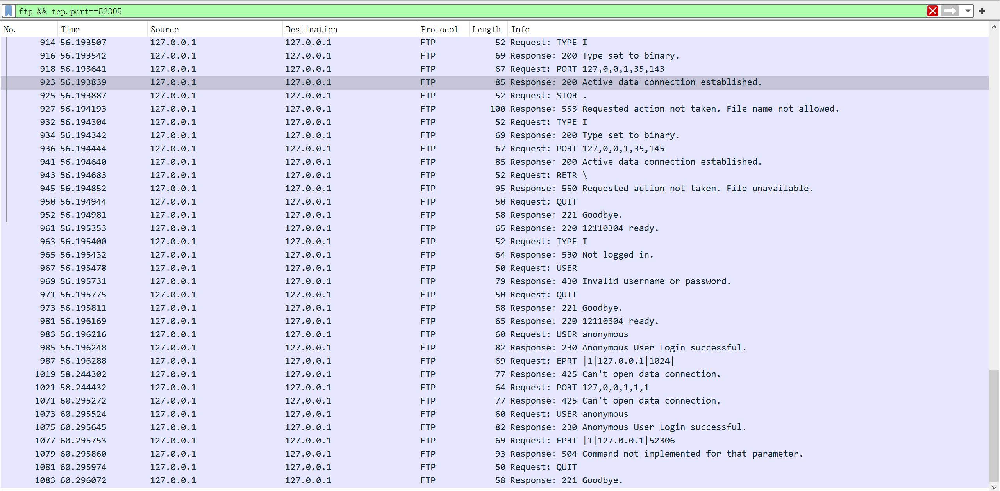

### **12110304 徐春晖**

------

### **Basic Task：**

#### 脚本评分：


#### Wiresharck 抓包：




------

### Other Task：

##### User login control (5 pts):

##### User privilege control (5 pts):

**功能展示：**

`Bob` 和 `Alice` 为储存在数据库中的用户，分别为普通用户和超级用户，正确密码为`b123` ，`a123`。


前两次为随意输入而不在数据库中的用户名，第三次查找到用户名并返回 `331`。

然后是一次错误的密码尝试，返回 `430` ，接着是一次正确的密码传输，通过登录并识别为 General User。

接着运行指令，然而作为普通用户的 `Bob` 没有 `STOR` 功能的访问权限。（为了方便演示没有进行 `PORT` 等数据传输接口的操作，下同）


在这里，作为超级用户的 `Alice` 被识别为 Super User，并将开放所有权限。

**实现思路：**

下面结合代码注释阐述实现


```python
if line[:4] == "USER":
    try:
        u_name = line[5:]
        if u_name == "anonymous": #匿名用户无需输入密码
            client.send(b"230 Anonymous User Login successful.\r\n")
            is_login = True
            is_super = True #默认为超级用户
        else:
            for line in open("users/userdata.txt"): #遍历data文件
                ud = line.split(' ') #处理原始数据
                if ud[0] == u_name: #如果用户名匹配成功
                    client.send(b"331 User name okay, need password.\r\n")
                    user = ud #记录下用户信息，等待密码匹配
                    on_login = True #准备登录状态
                    break

            if not on_login: #遍历完成而没有匹配上
                client.send(b"430 Invalid username or password.\r\n")

    except IndexError:
        client.send(b"430 Invalid username or password.\r\n")

elif on_login and line[:4] == "PASS": #处于准备登录状态并尝试传输密码
    if line[5:] == user[1]: #密码匹配成功
        is_login = True  #成功登录
        if user[2] == 'S\n': #如过数据库中记录的为超级用户
            is_super = True #记录超级用户权限
            client.send(b"230 Super User Login successful.\r\n")
        else: #否则为普通用户
            is_super = False #记录普通用户权限
            client.send(b"230 General User Login successful.\r\n")

    else: #密码错误
        client.send(b"430 Invalid username or password.\r\n")

else:
    client.send(b"530 Not logged in.\r\n")

```

STOR 部分：

```python
elif line[:4] == "STOR":
	filename = line[5:]
	if is_super:
    	#正常运行功能
	else: #无权限
    	client.send(b"532 Need super account for storing files.\r\n")
```

##### More commands (include `LIST`, `SIZE`, `SYST`, `PWD`, 2 pts each):

**功能展示**：

原始库里有两个文件，其中一个为手动编辑的 `text.txt` ，内容如图所示。


下图为四个命令的测试内容


下框为 `LIST` 命令的完整 Response

**实现思路：**

下面结合代码注释阐述实现

```python
elif line[:4] == "SIZE":
    filename = line[5:]

    try:
        with open(work_path + filename, 'rb') as f: #打开文件
            size = f.seek(0, os.SEEK_END) #扫描到文件底部
            client.send(b"Size is %d.\r\n" % size) #返回文件大小
    except FileNotFoundError:
        client.send(b"550 Requested action not taken. File unavailable.\r\n")

elif line[:4] == "SYST":
    client.send(b"12110304 powered by Windows 10.\r\n") #返回固定文本

elif line[:3] == "PWD":
    client.send((work_path + '\r\n').encode()) #返回当前工作的目录

elif line[:4] == "LIST":
    cnt = 1
    list_data = '' #准备传输的字符串 
    for file_name in os.listdir(work_path): #循环工作目录下的每一个文件
        list_data += "%d: %s.\n" % (cnt, file_name) #返回的字符串内容增加
        cnt += 1 #序号 +1

    client.send(list_data.encode()) #字符串编码为字节流

```

