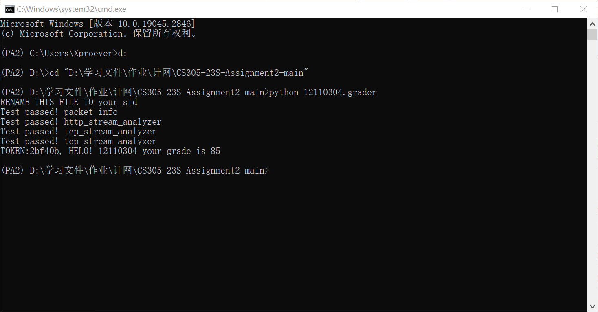
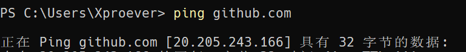
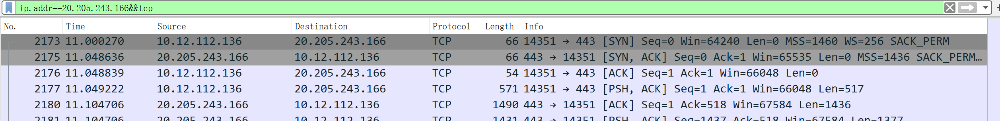
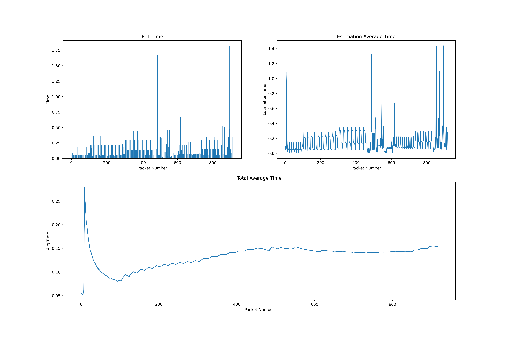

## CS305 2023Spring Programing Assignment 2

**12110304 徐春晖**

------

### **Task 1:**

#### 脚本评分：85分



------

### Task 2:

**功能展示：**

我测试的行为是 `RTT`，通过随意访问 GitHub 页面并进行抓包来判断同服务器的 RTT。





抓包文件为 `catch.pcapng`



其中，左上图为原始的每个包的 RTT 数据，右上图为 RTT 的加权累加平均值，类似于 TCP 协议中 RTT 估计值的算法，下图为为 RTT 的无权累加平均值。

因为是在一段时间内连续访问抓下来的包，可以近似认为是服务端和客户端连续通信。个别 RTT 较高的值可能是因为多个访问之间出现间隔，将间隔也一并记录了，不过不影响整体计算。

从上图可以看出，平均 RTT 值逐渐稳定。日常使用场景下，本机同 GitHub 的 RTT 约为 `0.15s`（包括了服务器数据准备与传输的时间）

**实现思路：**

```python
def read_ack(path, client_ip_prev, server_ip_prev, client_port_prev, server_port_prev):
    stream_info = (client_ip_prev, server_ip_prev, client_port_prev, server_port_prev)
    packets = rdpcap(path)
    times = []
    avg = []

    for pkt in packets:
        if not pkt.haslayer('TCP'):
            continue

        tcp = pkt.getlayer('TCP')
        if pkt.haslayer('IP'):
            ip = pkt.getlayer('IP')

            if (ip.src, ip.dst, tcp.sport, tcp.dport) == stream_info: #客户端发送
                times.append((tcp.ack, pkt.time)) #添加记录

            elif (ip.dst, ip.src, tcp.dport, tcp.sport) == stream_info: #服务端送回
                for t in times:
                    if tcp.seq == t[0]: #seq==ack
                        avg.append(pkt.time - t[1]) #记录差值

    return avg
```

对于客户端发送给服务端的每一个 ACK，记录下 ACK 包发送时间，并在客户端接受来自服务端的相同值的 SEQ 时，记录两包的时间差值。

然后以 `avg` 中的值进行绘图，代码如下：

```python
def draw_graph(ackss): #ackss即为上函数返回的avg
    plt.figure(figsize=(18, 12), dpi=400)
    x_values = list(range(len(ackss)))

    ax1 = plt.subplot(2, 2, 1)
    ax2 = plt.subplot(2, 1, 2)
    ax3 = plt.subplot(2, 2, 2)

"""
ax1: 原始数据导出，根据以上得出的avg绘图
"""
    plt.sca(ax1)
    plt.bar(x_values, ackss)
    plt.xlabel('Packet Number')
    plt.ylabel('Time')
    plt.title('RTT Time')
"""
ax3: 根据原始数据计算总平均绘图
"""
    cnt = 0
    tt = 0
    av = [] #纵轴值集合
    for a in ackss:
        cnt = cnt + 1
        tt = tt + a
        av.append(tt / cnt) #总平均时间

    plt.sca(ax2)
    x_values = list(range(len(av)))
    plt.plot(x_values, av)
    plt.xlabel('Packet Number')
    plt.ylabel('Avg Time')
    plt.title('Total Average Time')
"""
ax2: 加权平均绘图
"""
    est = [] #纵轴值集合
    e = 0.2
    for a in ackss:
        e = 0.25 * e + 0.75 * a #加权平均
        est.append(e)

    plt.sca(ax3)
    x_values = list(range(len(est)))
    plt.plot(x_values, est)
    plt.xlabel('Packet Number')
    plt.ylabel('Estimation Time')
    plt.title('Estimation Average Time')

    # Show the plot
    plt.show()
```

